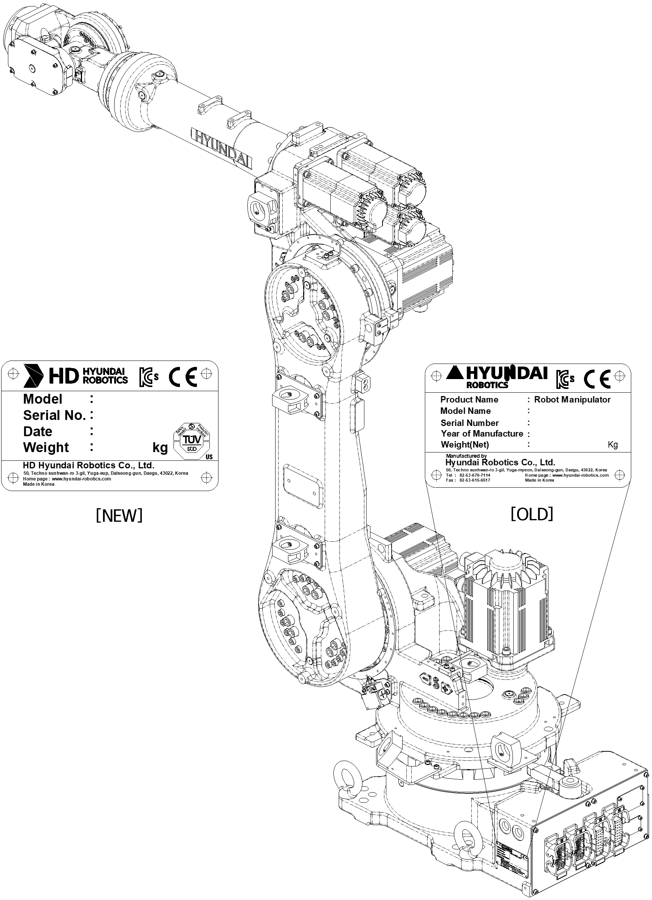

# 2.2. Location of Robot Identification Plate

The model name, serial number, and manufacturing date of robot are written down in the name plate. 

The name plate is located at the lower part of the main body (left or right) as shown below.

Figure 2.2 The location of identification plate
