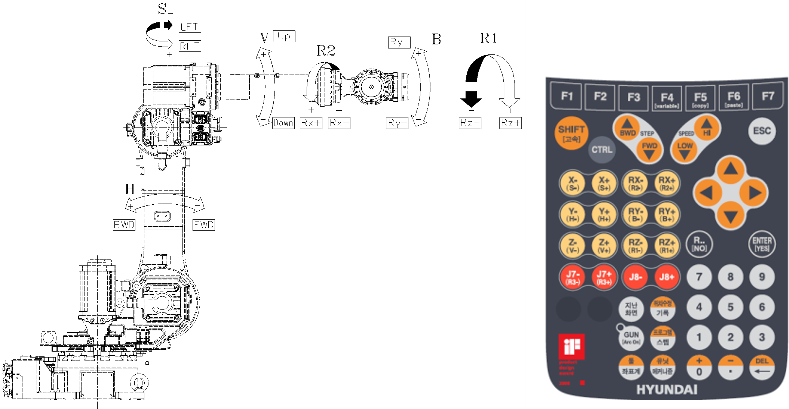

# 2.5. Axis Identification

Table 2-4 Axis Motion

<table class="tg">
<thead>
  <tr>
    <th class="tg-jx5t">Axis Name</th>
    <th class="tg-jx5t">Operation</th>
    <th class="tg-jx5t" colspan="2">Teach Pendant Button</th>
  </tr>
</thead>
<tbody>
  <tr>
    <td class="tg-dq1w">S</td>
    <td class="tg-ew0z">Arm Swivel</td>
    <td class="tg-ew0z">LFT(S+)</td>
    <td class="tg-ew0z">RHT(S-)</td>
  </tr>
  <tr>
    <td class="tg-dq1w">H</td>
    <td class="tg-ew0z">Arm Forward and Backward</td>
    <td class="tg-ew0z">BWD(H+)</td>
    <td class="tg-ew0z">FWD(H-)</td>
  </tr>
  <tr>
    <td class="tg-dq1w">V</td>
    <td class="tg-ew0z">Arm Upward and Downward</td>
    <td class="tg-ew0z">UP(V+)</td>
    <td class="tg-ew0z">DOWN(V-)</td>
  </tr>
  <tr>
    <td class="tg-dq1w">R2</td>
    <td class="tg-ew0z">Wrist Rotation 2</td>
    <td class="tg-ew0z">Rx+(R2+)</td>
    <td class="tg-ew0z">Rx-(R2-)</td>
  </tr>
  <tr>
    <td class="tg-dq1w">B</td>
    <td class="tg-ew0z">Wrist Bend</td>
    <td class="tg-ew0z">Ry+(B+)</td>
    <td class="tg-ew0z">Ry-(B-)</td>
  </tr>
  <tr>
    <td class="tg-dq1w">R1</td>
    <td class="tg-ew0z">Wrist Rotation 1</td>
    <td class="tg-ew0z">Rz+(R1+)</td>
    <td class="tg-ew0z">Rz-(R1-)</td>
  </tr>
</tbody>
</table>
  

Figure 2.8 Robot Dimension and Axis [YS080/YS100A/HH050/HH030L] - [HH050T] R2 axis excluded