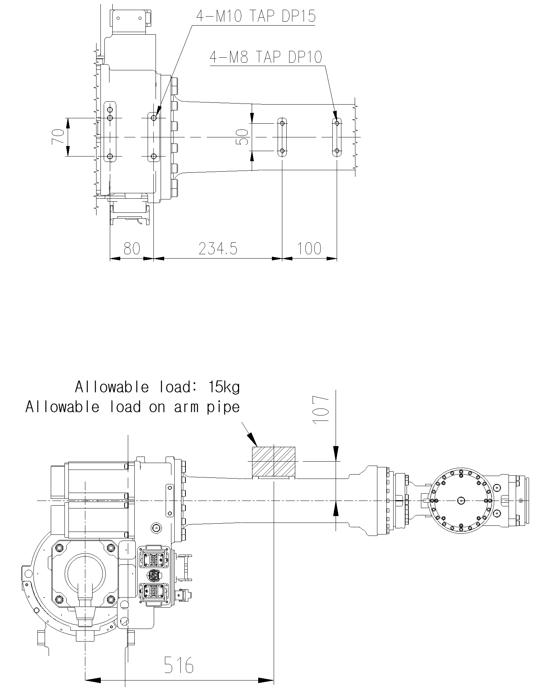

# 2.7. Details of ARM Frame Attachment Surface

The upper parts of the arm frame and arm pipe of the robots are attached using a tap designed to attach peripheral devices.

Within the area marked with ▦, peripheral devices (valves, etc.) shall be attached. 

<b>[Attention]</b>

Peripheral devices shall be attached either on the upper part of the arm frame or the upper part of the arm pipe. When attaching, be sure to the center position of gravity should be located within the range marked as ▦.

*	Max weight on the ARM PIPE : 15kg

Figure 2.10 Details of Upper ARM FRAME Attachment Surface: [YS080/YS100A/HH050/HH050T]

Figure 2.11 Details of Upper ARM FRAME Attachment Surface: [HH030L]