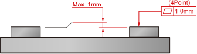

# 3.5.3. Accuracy of Installation Surface

The degree of flatness for the four attachment plate surfaces should satisfy the specification. Use a shim, if necessary. The rest of the surface must be flat within ±2mm.

* <b>Cautions</b>

①	The flatness of mounting plate must be within 1.0 mm.

②	Make four plane figures of a sealed plate of 1.0 mm (±0.5 mm) or less.

Figure 3.5 Accuracy of Installation surface
