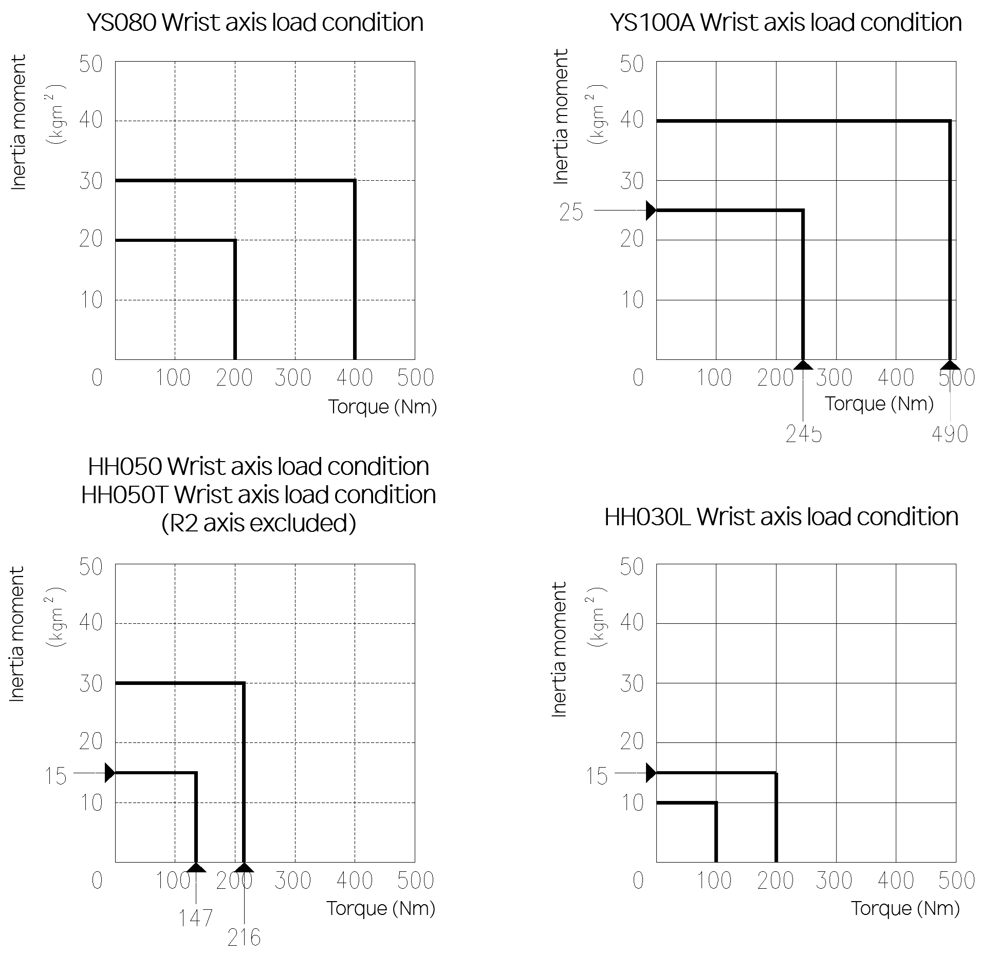

# 3.6.2. Permitted inertia moment estimation

Loads must be kept below maximum conditions shown in [Figure 3.8] ~ [Figure 3.11]. 

*	Step 1

    Calculate the inertia moment value of the load at each wrist axis center (Ja4, Ja5, Ja6)(Ja4, Ja5, Ja6)

    Ja4 - Inertia moment from R2 axis rotation center

    Ja5 - Inertia moment from B axis rotation center

    Ja6 - Inertia moment from R1 axis rotation center

*	Step 2

    Check if the inertia moment is under the thread according to the permissible inertia moment table.

Figure 3.12 Wrist Axis Load Condition: [YS080/YS100A/HH050/HH030L/HH050T]

 

 <b>Allowable Moment of Inertia</b>

Table 3-3 Allowable Moment of Inertia

<table class="tg">
<thead>
  <tr>
    <th class="tg-zegx" rowspan="2">Robot Model</th>
    <th class="tg-zegx" colspan="3">Allowable Moment of Inertia</th>
  </tr>
  <tr>
    <th class="tg-zegx">R2 Axis Rotation</th>
    <th class="tg-zegx">B Axis Rotation</th>
    <th class="tg-zegx">R1 Axis Rotation</th>
  </tr>
</thead>
<tbody>
  <tr>
    <td class="tg-nrix">YS080</td>
    <td class="tg-nrix" colspan="2">30 kg·m²(3.06 kgf·m·s²)</td>
    <td class="tg-nrix">20 kg·m²(2.04 kgf·m·s²)</td>
  </tr>
  <tr>
    <td class="tg-nrix">YS100A</td>
    <td class="tg-nrix" colspan="2">40 kg·m²(4.08 kgf·m·s²)</td>
    <td class="tg-nrix">25 kg·m²(2.55 kgf·m·s²)</td>
  </tr>
    <tr>
    <td class="tg-nrix">HH050</td>
    <td class="tg-nrix" colspan="2">30 kg·m²(2.04 kgf·m·s²)</td>
    <td class="tg-nrix">15 kg·m²(1.53 kgf·m·s²)</td>
  </tr>
    <tr>
    <td class="tg-nrix">HH030L</td>
    <td class="tg-nrix" colspan="2">15 kg·m²(1.53 kgf·m·s²)</td>
    <td class="tg-nrix">10 kg·m²(1.02 kgf·m·s²)</td>
  </tr>
    <tr>
    <td class="tg-nrix">HH050T</td>
    <td class="tg-nrix">-</td>
    <td class="tg-nrix">30 kg·m²(2.04 kgf·m·s²)</td>
    <td class="tg-nrix">15 kg·m²(1.53 kgf·m·s²)</td>
  </tr>
</tbody>
</table>