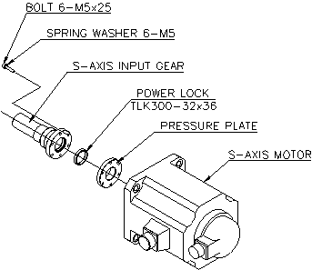
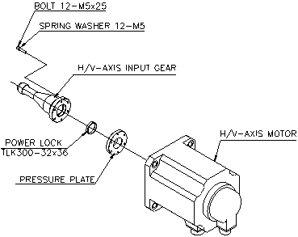

# 6.4.2.1. Motor for main axis (Hi5)

Figure 6.2 Axis S motor assembly

 

 <b>Caution</b>

If the entire upper arm is not completely attached to the mechanical stopper in a gravitational direction when replacing the motor of the V-axis, the upper arm may rotate when the motor is being dismantled.

 

Figure 6.3 Axis H&V Motor Assembly

