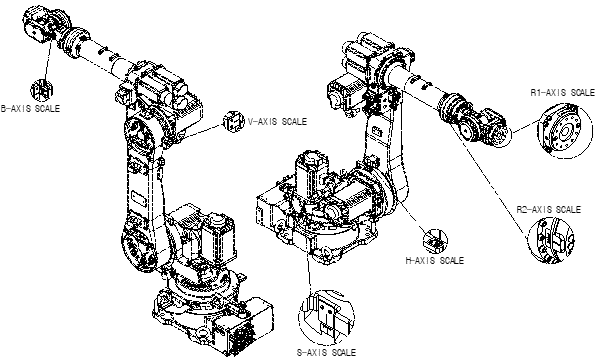

# 6.5.1. Zero Setting

<ol style="list-style-type:decimal" start="1">
<li>
Set the controller to teaching mode and set the robot to standby [ON] condition.
If the robot cannot be set to standby [ON] condition due to issues, use the brake cancel switch to set the reference location of the robot.
    </li> 
    <li>
Move each axis to the basic posture to align it with the scale or V-groove.
    </li> 
    <li>
Reset the Encoder. Refer to 『6.5.2 Encoder Reset』for the method of encoder reset.
    </li> 
    <li>
Correct the encoder. Refer to 『Controller Operation Manual』.
    </li> 
    <li>
Confirm that there is no problem in robot motion.
</li>
</ol>
 

Figure 6.8 Method of Zero Setting [YS080/YS100A/HH050/HH030L] - [HH050T - R2 axis excluded]