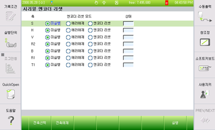

# 6.5.2. Encoder Reset

<ol style="list-style-type:decimal" start="1">
    <li>Turn off the motor.
    </li> 
    <li>
Open the serial encoder reset window. (『[F2]: System』 → 『5: Initialize』 → 『4: Serial encoder reset』)

  

 

</li> 
    <li>
Use keys like [↓], [↑], [SHIFT] + [←][→] to move to a desirable axis, then press the [Execute] key.
</li> 
    <li>After the encoder is reset, please make sure the controller power is turned on.
</li>
</ol>
